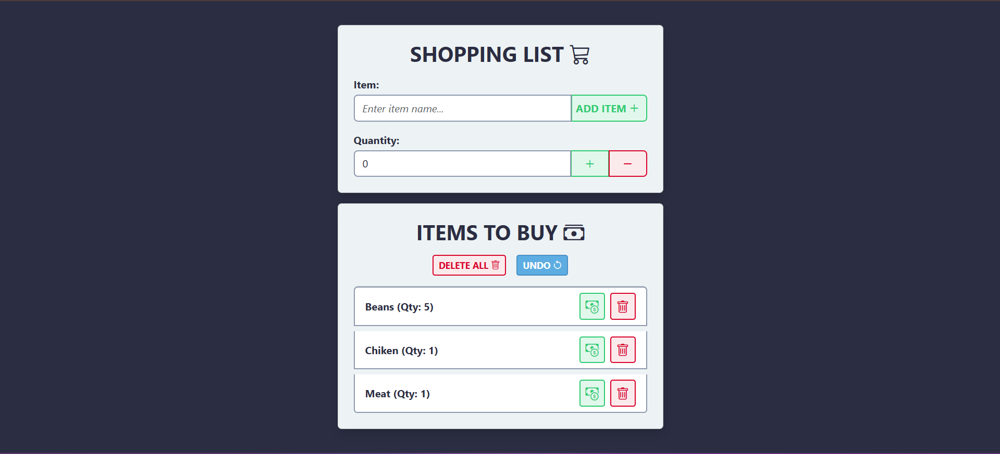
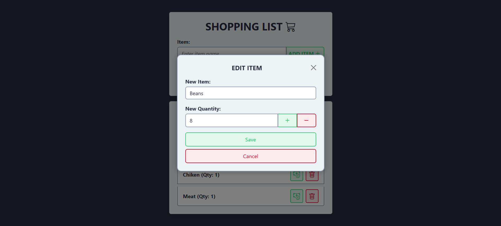
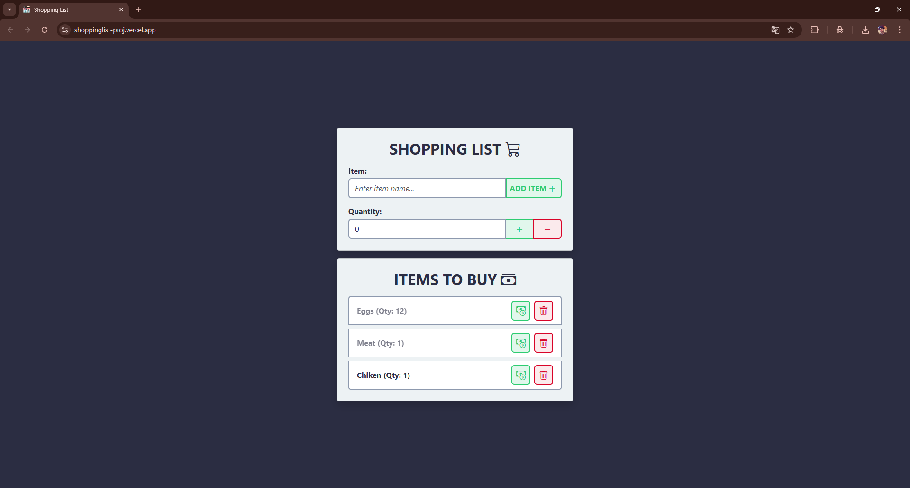

# 🛒 Shopping List

Uma aplicação web simples para gerenciar sua lista de compras. Permite adicionar, editar, marcar como comprado e remover itens — tudo com uma interface intuitiva, responsiva e estilizada com Bootstrap 5.

## 🚀 Funcionalidades

- ✅ Adicionar itens com nome e quantidade
- ✏️ Editar nome e quantidade de um item
- 🛍️ Marcar itens como comprados
- ❌ Excluir itens da lista
- 💾 Persistência com LocalStorage
- 📱 Responsivo para dispositivos móveis

## 🧩 Estrutura do Projeto

```bash
.
├── img
│   ├── img1.png
│   ├── img2.png
│   └── img3.png
├── node_modules
├── public
│   ├── mart.png
│   └── vite.svg
├── src
│   ├── logic
│   │   ├── logic.ts
│   │   ├── storage.ts
│   │   └── ui.ts
│   ├── styles
│   │   ├── _base.css
│   │   ├── _buttons.css
│   │   ├── _lists.css
│   │   ├── _modal.css
│   │   ├── _variables.css
│   │   └── main.css
│   ├── main.ts
│   └── types.ts
├── index.html
├── package.json
├── package-lock.json
├── tsconfig.json
└── README.md

```

## 🛠️ Como Executar Localmente

1. **Clone o repositório**
```bash
git clone https://github.com/seu-usuario/shopping-list.git
cd shopping-list
```

2. **Instale as dependências**
```bash
npm install
```

3. **Execute o projeto**
```bash
npm run dev
```

O Vite abrirá a aplicação no navegador (geralmente em `http://localhost:5173`).

## 📌 Observações

- O projeto não utiliza framework JS como React, apesar de estar configurado com Vite + TypeScript.
- O controle de estado é feito com `localStorage`, ideal para pequenos projetos ou testes de UI.

## 🖼️ Captura de Tela

<p align="center">
    
    
    
</p>

## 📦 Tecnologias Utilizadas

- Vite
- TypeScript
- Bootstrap 5
- Bootstrap Icons
- HTML5 / CSS3

## 📄 Licença

Este projeto está licenciado sob a licença MIT. Veja o arquivo `LICENSE` para mais detalhes.